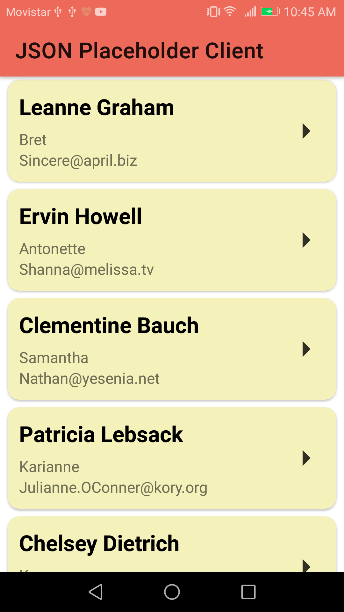
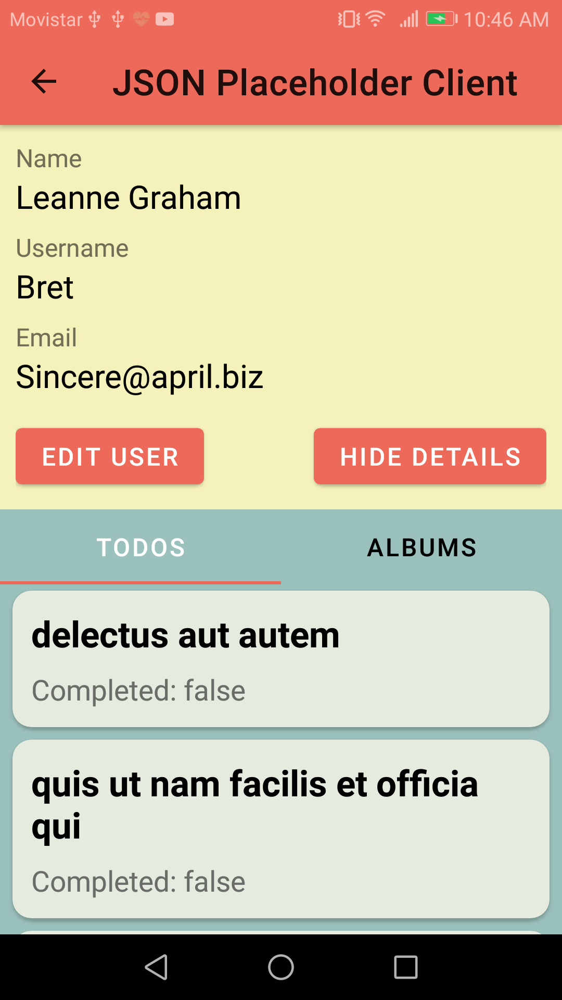
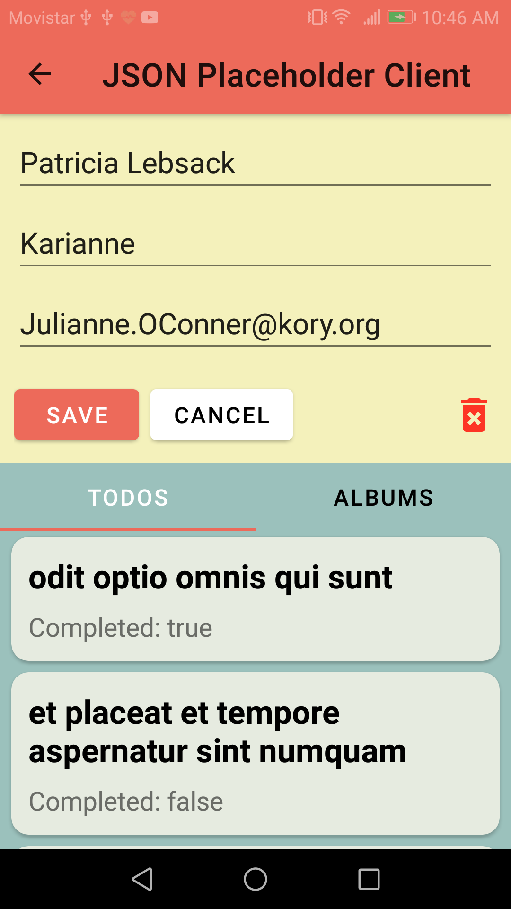
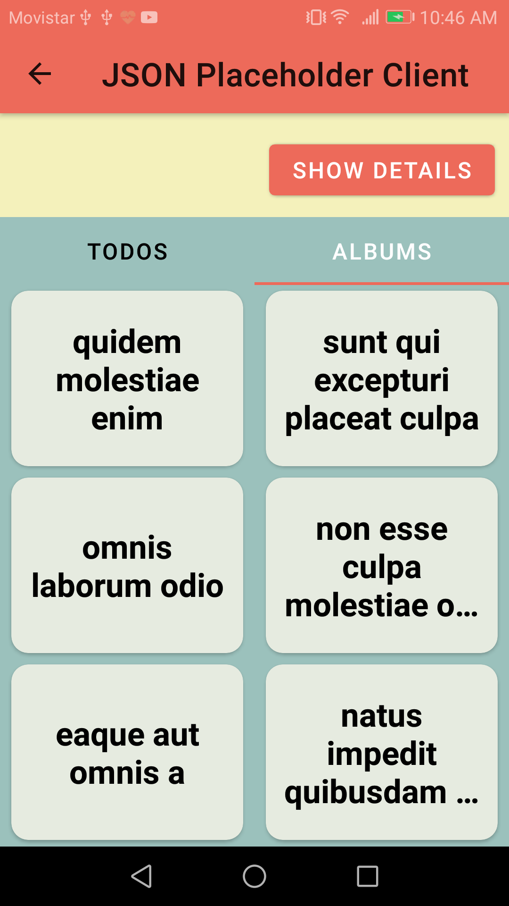

# JSON_Placeholder_Android_Client
A https://jsonplaceholder.typicode.com client built in native Android with Java / Un cliente de https://jsonplaceholder.typicode.com/ construido en Android nativo con Java

## See the app in action / Mire la aplicación en funcionamiento

## Some features / Algunas características

- Consuming a Rest API
- HTTP Request (GET, PUT, DELETE)
- GET multiple data according to the user selected
- Use of JSONObjects (Serialize and deserialize)
- Display data in list and grid way
- Use of fragments in TabLayout and ViewPager

## Some images / Algunas imágenes

|

|

|
|------------|-------------|
|

|

|